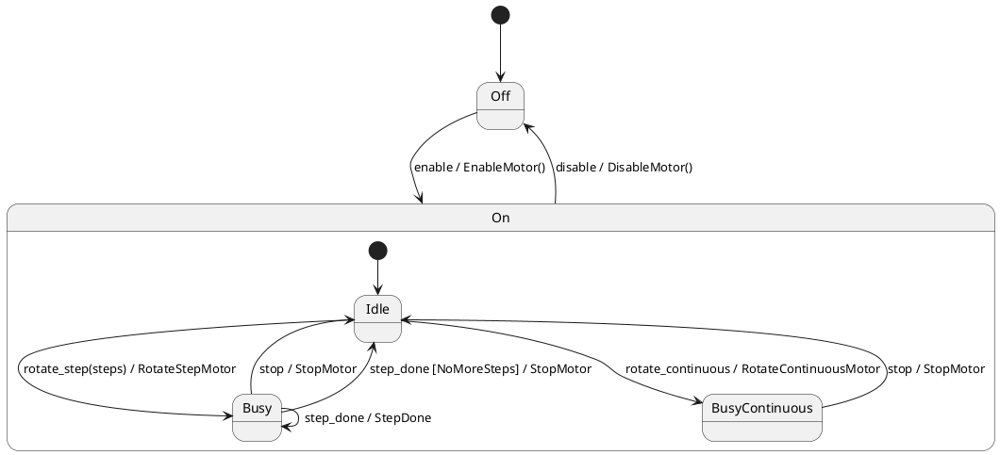

# State Machine using Actions



```
----- process event  --> enable 
+enableMotor
      -- On: on_entry: Off --> Idle
      -- Idle: on_entry: Off --> Idle
----- process event  --> rotate_step 
+rotateStep: 3
      -- Busy: on_entry: Idle --> Busy
----- process event  --> step_done 
      -- Busy: on_exit: Busy --> Busy
+stepDone: remains 3 step(s)
      -- Busy: on_entry: Busy --> Busy
----- process event  --> step_done 
      -- Busy: on_exit: Busy --> Busy
+stepDone: remains 2 step(s)
      -- Busy: on_entry: Busy --> Busy
----- process event  --> step_done 
      -- Busy: on_exit: Busy --> Busy
+stepDone: remains 1 step(s)
      -- Busy: on_entry: Busy --> Busy
----- process event  --> step_done 
      -- Busy: on_exit: Busy --> Idle
+stopMotor
      -- Idle: on_entry: Busy --> Idle
----- process event  --> step_done 
----- process event  --> disable 
      -- On: on_exit: On --> Off
+disableMotor
      -- Off: on_entry: On --> Off

```
