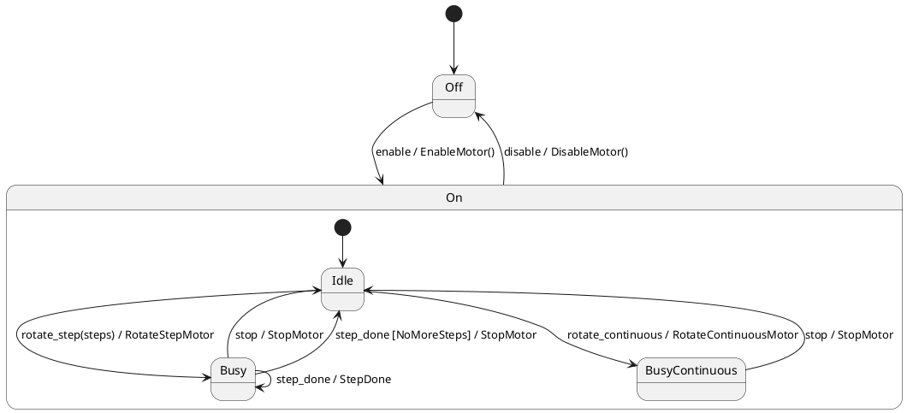

# State Machine using Actions



```
----- process event  --> enable
+enableMotor
-- on entry: Off --> Idle
-- on entry: Off --> Idle
----- process event  --> rotate_step
+rotateStep
-- on entry: Idle --> Busy
----- process event  --> step_done
-- on exit: Busy --> Busy
+stepDone: 3
-- on entry: Busy --> Busy
----- process event  --> step_done
-- on exit: Busy --> Busy
+stepDone: 2
-- on entry: Busy --> Busy
----- process event  --> step_done
-- on exit: Busy --> Busy
+stepDone: 1
-- on entry: Busy --> Busy
----- process event  --> step_done
-- on exit: Busy --> Idle
+stopMotor
-- on entry: Busy --> Idle
----- process event  --> step_done
----- process event  --> disable
-- on exit: On --> Off
+disableMotor
-- on entry: On --> Off
```
